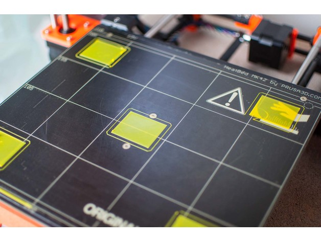

# Unser 3D Drucker im Hacklab Bern

Der 3D Drucker im **Hacklab Bern**, basiert auf dem CL-260 open-source model[hier](https://www.thingiverse.com/minicooper/collections/cl-260) und [hier](https://www.thingiverse.com/groups/cl-260/things). Er wird abwechslungsweise von Mitgliedern genutzt und verbessert, die dies wünschen.

## Empfohlene Einstellungen

| Funktionalität | Verwendete Lösung |
| ---- | --- |
| Drucker Art | FFF |
| Druckauflösung | 0.15mm |
| PLA Temperatur | 210°C |
| Hot bed Temperatur | 55°C |

## Bestandteile

| Funktionalität | Verwendete Lösung | Alternativen |
| ---- | --- | --- |
| Firmware | [Marlin](https://github.com/MarlinFirmware/Marlin) | [Repetier](https://www.repetier.com/download-software) |
| Mikrocontroller            | [Arduino Mega 2560](https://www.3dware.ch/Iduino-MEGA2560-De.htm) |
| Leistungselektronik Shield | [RepRap Arduino Mega Pololu Shield (RAMPS) 1.4](https://reprap.org/wiki/RAMPS_1.4) |
| Verstärker Schrittmotoren  | [A4988 Datasheet](https://www.allegromicro.com/~/media/Files/Datasheets/A4988-Datasheet.ashx) |
| Display Platine     | ?   |
| Heat Bed            | https://reprap.org/wiki/RAMPS_1.4    |
| Hot End             | Hotend: e3d v6 |
| Nozzle | 0.4mm |
| Schrittmotoren      |     |

### Calibration patterns

Zur Prüfung der Ausrichtung des Heizbetts eignen sich dieses speziellen Quadratmuster. Es erlaubt die Prüfung
der Druckhöhe und der Distanz zwischen Hotend und Heizbetts.

- Video: https://youtu.be/RZRY6kunAvs
- Quelle: https://www.thingiverse.com/thing:2789086
- STL: [calibration_patterns](calibration_patterns)

### Bessere Z-Axis Distanzeinhaltung

Nur eine präzises Startdistanz zum Heizbett erlaubt präzise erste Schichten.

#### Verbesserte Stopp Schalter Führung

Der End-Stops soll den Schalter wiederholbar zum gleichen Zeitpunkt auslösen. Der Würfel erlaubt
grössere Toleranzen zum Treffen des Schalters.

Quelle:
- https://www.thingiverse.com/thing:2851658
- STL: [z_axis_sensor_print](z_axis_sensor_print)

#### Abstandsensoren

Bed Auto Leveling
- https://youtu.be/G-TwWfUzXpc
- Sensor: https://de.aliexpress.com/item/32568347298.html 

