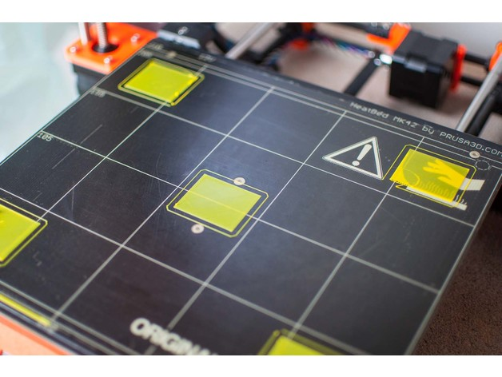
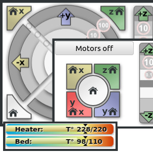
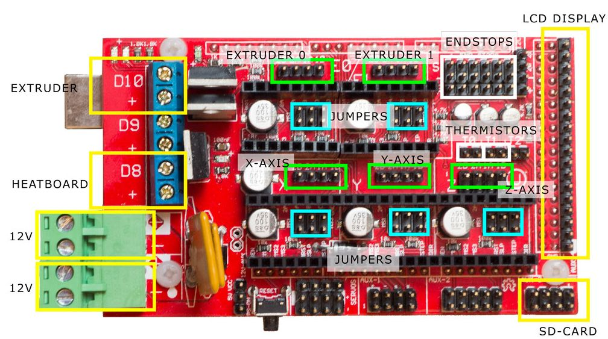
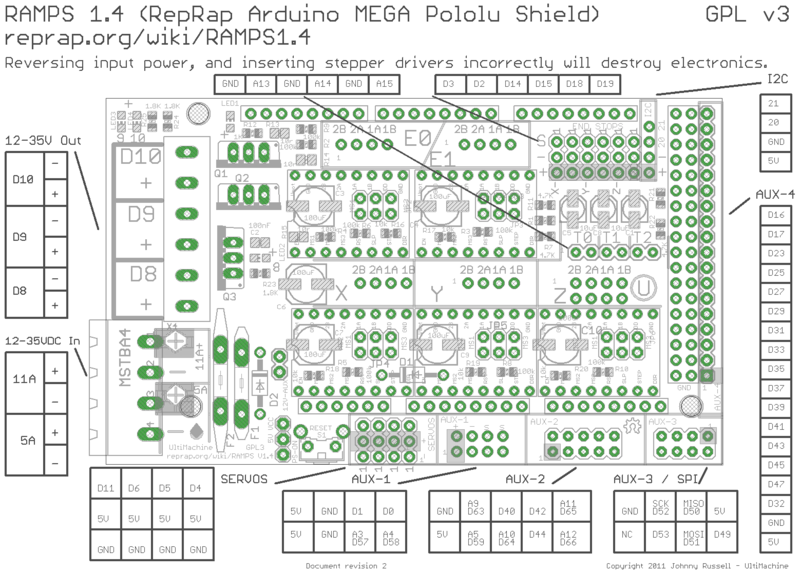
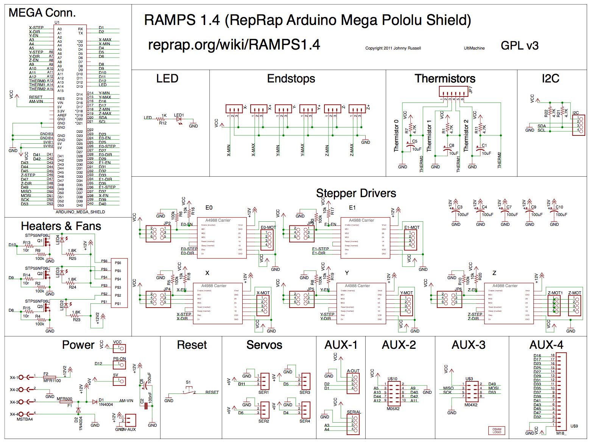
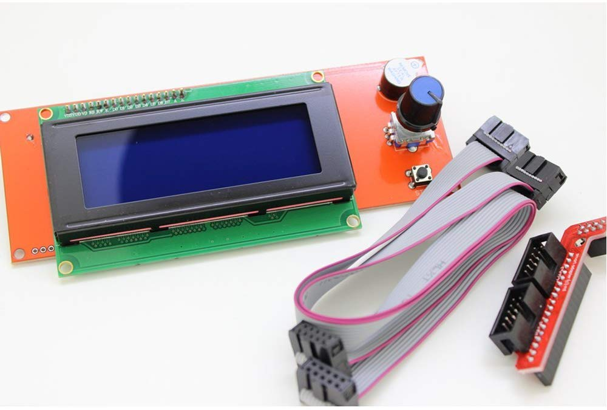
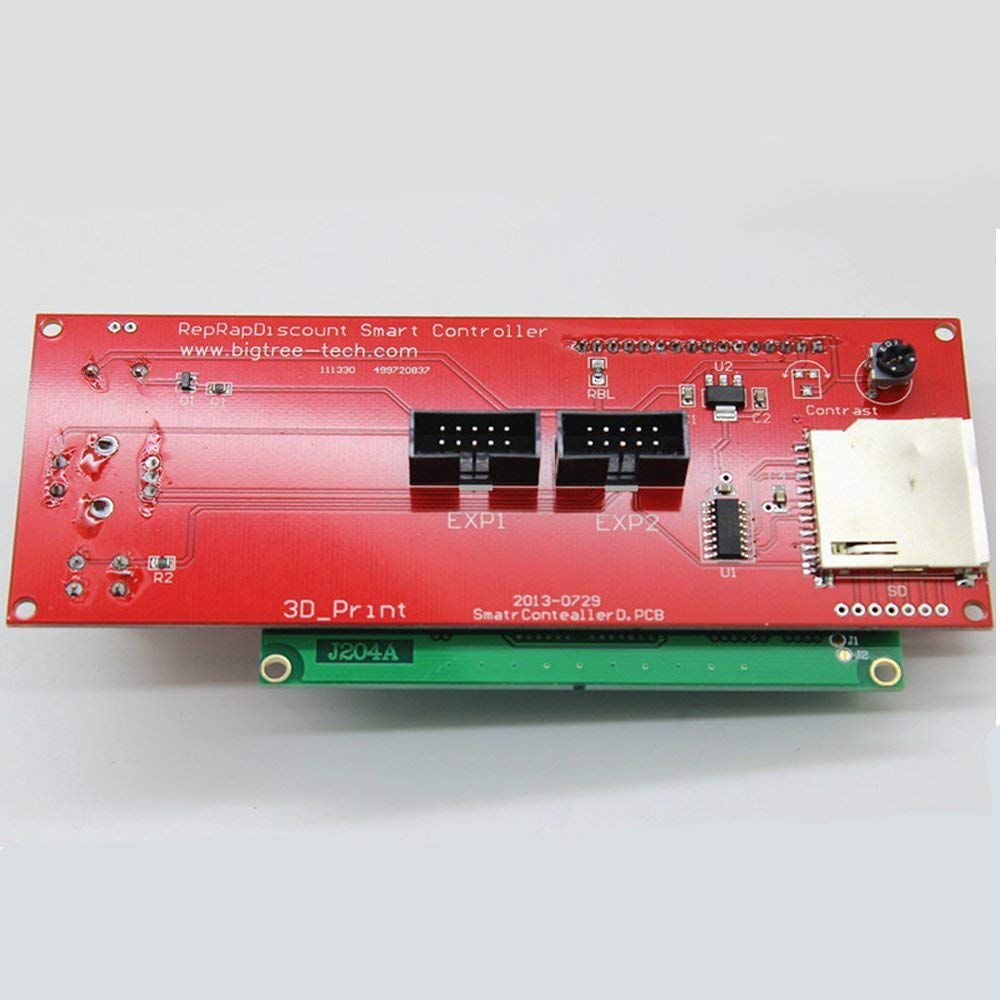
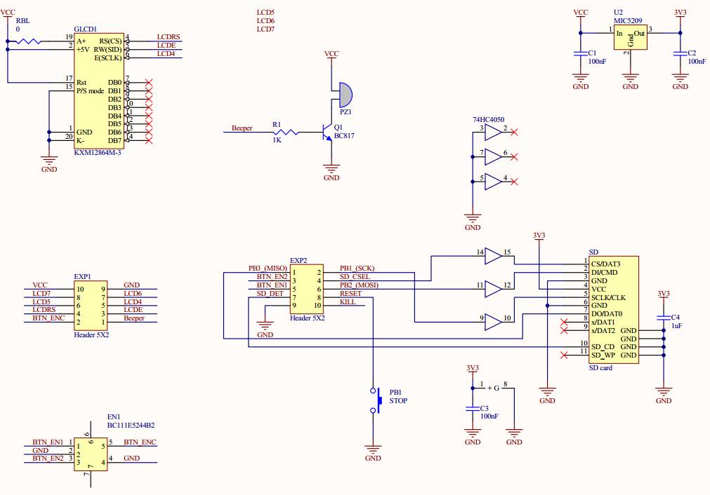
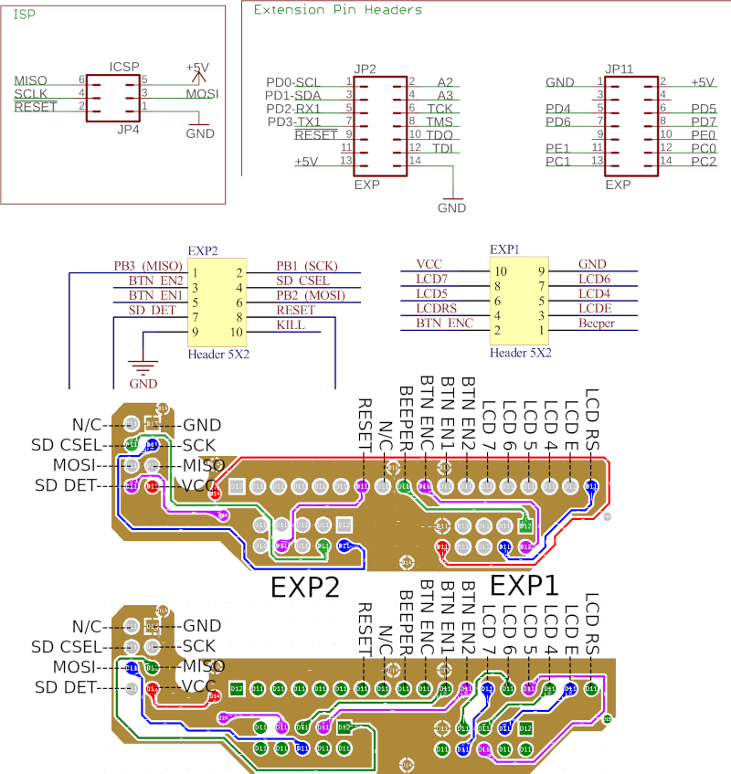
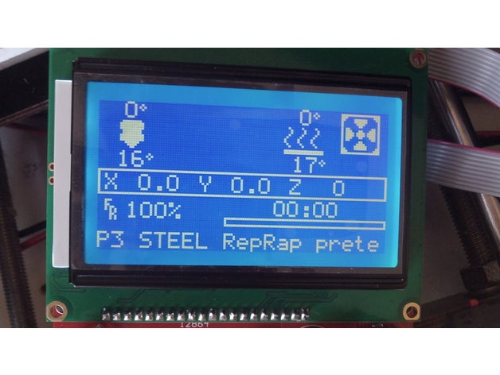

.. image:: https://readthedocs.org/projects/3d-printer-hacklab/badge/?version=latest
   :target: https://3d-printer-hacklab.readthedocs.io/en/latest/?badge=latest

.. readme-header-marker-do-not-remove

Unser 3D Drucker im Hacklab Bern
################################

Anleitung zum Drucken
~~~~~~~~~~~~~~~~~~~~~

Der 3D Drucker im `**Hacklab Bern** <https://www.meetup.com/de-DE/Bern-Silicon-Valley-HackLab-Tech-Group>`_,
basiert auf dem `CL-260 <https://www.thingiverse.com/groups/cl-260/things>`_ 
open-source `Model <https://www.thingiverse.com/minicooper/collections/cl-260>`_.
Er wird abwechslungsweise von Mitgliedern genutzt und verbessert.

Empfohlene PC/Mac Software
==========================

Die folgenden Software hat sich für den PC bewährt:

+-------------------------------------------------------+---------------+-------------------+
|                       Software                        |     Zweck     | Chocolately Paket |
+=======================================================+===============+===================+
| Cura                                                  | Slicer        | cura-new          |
+-------------------------------------------------------+---------------+-------------------+
| `Prusa Slicer <https://www.prusa3d.com/prusaslicer>`_ | Slicer        | prusaslicer       |
+-------------------------------------------------------+---------------+-------------------+
| `Pronterface <https://www.pronterface.com/>`_         | Fernsteuerung | printrun          |
+-------------------------------------------------------+---------------+-------------------+

Empfohlene Filamente
====================

Filamente können hier bezogen werden:

- Im FabLab Bern: https://www.objektweberei.ch
- Online u.a. bei 3D-Jake: https://www.3djake.ch/de-CH/filament/pla-filament

Empfohlene Einstellungen
========================

Die folgenden Einstellungen haben sich für den Drucker bewährt.

+--------------------+----------------------------------+
|    Einstellung     |         Empfohlener Wert         |
+====================+==================================+
| Drucker Art        | FFF (Fused Filament Fabrication) |
+--------------------+----------------------------------+
| Druckauflösung     | 0.15mm                           |
+--------------------+----------------------------------+
| PLA Temperatur     | 210°C                            |
+--------------------+----------------------------------+
| Hot bed Temperatur | 55°C                             |
+--------------------+----------------------------------+
| Retraction         | 5mm                              |
+--------------------+----------------------------------+

Fehlersuche
===========

Die Fehlersuche am Drucker ist mühsam, allerdings bietet Pursa ein Handbuch
zum Erkennen der gängigsten Fehler:

- https://www.prusa3d.com/print-quality-troubleshooting/

Dazu hat auch der 3D-Andi ein hervorragendes Video mit vielen Fehlerquellen und -lösungen gedreht:

- https://www.youtube.com/watch?v=WL3T_ijUUs8

Düse montieren
==============

Bei der Montage der Düse ist sicherzustellen, dass die Düse kalt nur 0.7mm vor dem Limit angezogen ist.
In warmem Zustand kann die Düse zusätzlich nach ajustiert werden.

- https://youtu.be/OzRAVkXjw3I

Kalibrationsmuster
==================

Zur Prüfung der Ausrichtung des Heizbetts eignen sich dieses speziellen Quadratmuster. Es erlaubt die Prüfung
der Druckhöhe und der Distanz zwischen Hotend und Heizbetts.

- Video: https://youtu.be/RZRY6kunAvs
- Quelle: https://www.thingiverse.com/thing:2789086
- STL: `calibration_patterns <https://github.com/chatelao/3dprinter_hacklab/tree/master/calibration_patterns>`_

Weitere Kalibrierungsmuster:
- https://www.youtube.com/watch?v=kgCjDy_IgXg

Support Forum
=============

- https://www.3d-druck-community.de/

Aktueller Aufbau
################

Die Mitglieder verbessern den Aufbau des Druckers laufend. Aktuell setzt er sich wie folgt zusammen:

+---------------------------------------------------------+-------------------------------------------------------------------------------------------------------------------------+
|                     Funktionalität                      |                                                    Verwendete Lösung                                                    |
+=========================================================+=========================================================================================================================+
| Firmware                                                | `Marlin 2.0.x <https://github.com/MarlinFirmware/Marlin>`_                                                              |
+---------------------------------------------------------+-------------------------------------------------------------------------------------------------------------------------+
| Mikrocontroller                                         | `Arduino Mega 2560 <https://www.3dware.ch/Iduino-MEGA2560-De.htm>`_                                                     |
+---------------------------------------------------------+-------------------------------------------------------------------------------------------------------------------------+
| Leistungselektronik Shield                              | `RepRap-Arduino-Mega-Pololu-Shield (RAMPS) 1.4 <https://reprap.org/wiki/RAMPS_1.4>`_                                    |
+---------------------------------------------------------+-------------------------------------------------------------------------------------------------------------------------+
| Verstärker Schrittmotoren                               | `A4988 Datasheet <https://www.allegromicro.com/~/media/Files/Datasheets/A4988-Datasheet.ashx>`_                         |
+---------------------------------------------------------+-------------------------------------------------------------------------------------------------------------------------+
| Display Platine                                         | `RepRapdiscount smart controller 2004 LCD (RED) <https://reprap.org/wiki/RepRapDiscount_Smart_Controller>`_             |
+---------------------------------------------------------+-------------------------------------------------------------------------------------------------------------------------+
| Schrittmotoren                                          | NEMA ?                                                                                                                  |
+---------------------------------------------------------+-------------------------------------------------------------------------------------------------------------------------+
| Zahnriemen                                              | 5mm breit, 2mm Zahnschritt                                                                                              |
+---------------------------------------------------------+-------------------------------------------------------------------------------------------------------------------------+
| Antriebsstangen                                         | 8mm Stahlstangen                                                                                                        |
+---------------------------------------------------------+-------------------------------------------------------------------------------------------------------------------------+
| Lager der Antriebsstangen                               | 8 mm (innen) / 22 mm (aussen) / 7 mmm (Dicke) Standardlager                                                             |
+---------------------------------------------------------+-------------------------------------------------------------------------------------------------------------------------+
| Pulley                                                  | 20 Zähne, 8mm Innendurchmesser, mit M3 Imbusfixierung                                                                   |
+---------------------------------------------------------+-------------------------------------------------------------------------------------------------------------------------+
| Heat Bed                                                |                                                                                                                         |
+---------------------------------------------------------+-------------------------------------------------------------------------------------------------------------------------+
| Hot End                                                 | Hotend: e3d v6                                                                                                          |
+---------------------------------------------------------+-------------------------------------------------------------------------------------------------------------------------+
| Nozzle                                                  | 0.4mm                                                                                                                   |
+---------------------------------------------------------+-------------------------------------------------------------------------------------------------------------------------+
| `3D Teile <https://www.thingiverse.com/thing:1800495>`_ | Gedruckte Teile                                                                                                         |
+---------------------------------------------------------+-------------------------------------------------------------------------------------------------------------------------+
| Stromversorgung                                         | Schaltnetzteil 12V 20A ohne aktive Kühlung                                                                              |
+---------------------------------------------------------+-------------------------------------------------------------------------------------------------------------------------+
| Medium                                                  | SD-Karte, regulärer Grösse                                                                                              |
+---------------------------------------------------------+-------------------------------------------------------------------------------------------------------------------------+
| Datenkabel                                              | USB-Kabel mit Standard-B Stecker den Mikrocontroller                                                                    |
+---------------------------------------------------------+-------------------------------------------------------------------------------------------------------------------------+

.. _Repetier: https://www.repetier.com/download-software

Marlin Konfiguration
~~~~~~~~~~~~~~~~~~~~

Mit der Pronterface_ Software kann der Drucker über `gCode Befehle <http://marlinfw.org/docs/gcode/M115.html>`_ oder das GUI mit der seriellen Schnittstelle ferngesteuert und untersucht werden:

M115 - Firmware Informations
============================

::

   >>> M115
   SENDING:M115
   FIRMWARE_NAME:Marlin 2.0.x (GitHub)
   SOURCE_CODE_URL:https://github.com/MarlinFirmware/Marlin
   PROTOCOL_VERSION:1.0
   MACHINE_TYPE:Hacklab CL260 
   EXTRUDER_COUNT:1 
   UUID:b01ac89d-d7b3-43ec-8f82-dfb65c785486
   
   Cap:SERIAL_XON_XOFF:0
   Cap:BINARY_FILE_TRANSFER:0
   Cap:EEPROM:0
   Cap:VOLUMETRIC:1
   Cap:AUTOREPORT_TEMP:1
   Cap:PROGRESS:0
   Cap:PRINT_JOB:1
   Cap:AUTOLEVEL:0
   Cap:Z_PROBE:0
   Cap:LEVELING_DATA:0
   Cap:BUILD_PERCENT:0
   Cap:SOFTWARE_POWER:0
   Cap:TOGGLE_LIGHTS:0
   Cap:CASE_LIGHT_BRIGHTNESS:0
   Cap:EMERGENCY_PARSER:0
   Cap:PROMPT_SUPPORT:0
   Cap:AUTOREPORT_SD_STATUS:0

M503 - Report Settings (Marlin 2.0.x)
=====================================

+--------------------------------+----------------------------------------------------+--------------+
|          Einstellung           | gCode                                              | Marlin 2.0.x |
+================================+====================================================+==============+
| Units in mm (mm)               | `G21 <http://marlinfw.org/docs/gcode/G021.html>`_  |              |
+--------------------------------+----------------------------------------------------+--------------+
| Filament diameter              | `M200 <http://marlinfw.org/docs/gcode/m200.html>`_ | D1.75        |
+--------------------------------+----------------------------------------------------+--------------+
| Steps per unit                 | `M92 <http://marlinfw.org/docs/gcode/M92>`_        | X80.00       |
|                                |                                                    +--------------+
|                                |                                                    | Y80.00       |
|                                |                                                    +--------------+
|                                |                                                    | Z1600.00     |
|                                |                                                    +--------------+
|                                |                                                    | E161.00      |
+--------------------------------+----------------------------------------------------+--------------+
| Max. Speed (mm/s)              | `M203 <http://marlinfw.org/docs/gcode/M203.html>`_ | X300.00      |
|                                |                                                    +--------------+
|                                |                                                    | Y300.00      |
|                                |                                                    +--------------+
|                                |                                                    | Z5.00        |
|                                |                                                    +--------------+
|                                |                                                    | E45.00       |
+--------------------------------+----------------------------------------------------+--------------+
| Max. Acceleration (mm/s2)      | `M201 <http://marlinfw.org/docs/gcode/M201.html>`_ | X9000        |
|                                |                                                    +--------------+
|                                |                                                    | Y9000        |
|                                |                                                    +--------------+
|                                |                                                    | Z100         |
|                                |                                                    +--------------+
|                                |                                                    | E10000       |
+--------------------------------+----------------------------------------------------+--------------+
| S=Acceleration                 | `M204 <http://marlinfw.org/docs/gcode/M204.html>`_ |              |
+--------------------------------+                                                    +--------------+
| P=Print Acceleration (mm/s2)   |                                                    | P3000.00     |
+--------------------------------+                                                    +--------------+
| R=Retract Acceleration (mm/s2) |                                                    | R3000.00     |
+--------------------------------+                                                    +--------------+
| T=Retract Acceleration (mm/s2) |                                                    |              |
+--------------------------------+                                                    +--------------+
| T=Travel Acceleration (mm/s2)  |                                                    | T3000.00     |
+--------------------------------+----------------------------------------------------+--------------+
| B=minimum segment time (ms)    | `M205 <http://marlinfw.org/docs/gcode/M205.html>`_ | B20000       |
+--------------------------------+                                                    +--------------+
| S=Min feedrate (mm/s)          |                                                    | S0.00        |
+--------------------------------+                                                    +--------------+
| T=Min travel feedrate (mm/s)   |                                                    | T0.00        |
+--------------------------------+                                                    +--------------+
| J=Junc_dev                     |                                                    | J0.01        |
+--------------------------------+----------------------------------------------------+--------------+
| Home offset (mm)               | `M206 <http://marlinfw.org/docs/gcode/M206.html>`_ | X0.00        |
|                                |                                                    | Y0.00        |
|                                |                                                    | Z0.00        |
+--------------------------------+----------------------------------------------------+--------------+
| Hotend PID settings            | `M301 <http://marlinfw.org/docs/gcode/M301.html>`_ | P22.20       |
|                                |                                                    +--------------+
|                                |                                                    | I1.08        |
|                                |                                                    +--------------+
|                                |                                                    | D114.00      |
+--------------------------------+----------------------------------------------------+--------------+

Der RepRap Shield
~~~~~~~~~~~~~~~~~

Das **RepRap Arduino Mega Pololu Shield** dient als Plattform zur Anbindung
aller weiteren Eletronik am System:

1. Dem *Arduino Mega* als Microkontroller
2. Den Schrittmotoren, ihren Reglern und Endsensoren
3. Dem Heizkopf und -bett, sowie ihren jeweiligen Messfühlern
4. Dem LCD-Display und Drehtaster mit SD-Kartenleser
5. Den Lüftern für den Heizkopf und das Material
6. etc.

Die Stecker und Verkabelungen
=============================

.. image:: 11_RAMPS_14/Rampswire14.svg
   :width: 500 px

Das elektronische Schema
========================

Der LCD-Display mit Taster & SD-Kartenlesen
~~~~~~~~~~~~~~~~~~~~~~~~~~~~~~~~~~~~~~~~~~~

Das elektronische Schema
========================

.. readme-next-page-do-not-remove

Geplante Verbesserungen
#######################

Erweiterungen
~~~~~~~~~~~~~

https://www.aliexpress.com/item/4000211772563.html

Ersatz bestehender Teile
~~~~~~~~~~~~~~~~~~~~~~~~

Neue TMC3120 Treiber für Schrittmotoren
=======================================

Die aktuellen Treiberchips der Schrittmotoren sind klassische Pololu A4988.
Diese Trieber steuern den Drucker korrekt, aber können keine Schrittverluste
erkennen oder korrigieren. Die Motoren sind bei der Ansteuerung auch relativ laut.

Die Alternative dazu sind die TMC2130 der Firma Trinamic. Sie erlauben es, 
Blockierungen und damit Schrittverluste zu erkenne.

- Anleitung zum Erhalten der LCD und SD-Karte (Chris Riley): https://www.youtube.com/watch?v=kMICfCa6bHk

- Alterativ, aber unvollständig (Tom Sandladerer): https://www.youtube.com/watch?v=sPvTB3irCxQ&t=728s

RAMPS Ersatz mit 32-bit Prozessor
=================================

Die Kombination RAMPS1.4 und Arduino Mega ist der de-facto standard für 3D-Drucker.
Aktuell besteht nur ein geringer Bedarf diese Kombination abzulösen, da nur folgende
Schwächen bestehen:

#. Die Leistung der Heizausgänge ist auf 11A beschränkt (MKS v1.3: 20A)
#. Die Unterstützung eines TFT-Touchpanels ist mir nicht bekannt
#. Die Rechenleistung im 8-Bit Kontroller ist geriner als im 32-bit Modell

Ein  Kandidat wäre das BigTreeTech SKR V1.3
- https://www.aliexpress.com/item/32981807406.html

Bessere Z-Axis Distanzeinhaltung
================================

Nur eine präzises Startdistanz zum Heizbett erlaubt präzise erste Schichten.

Verbesserte Stopp Schalter Führung
----------------------------------

Der End-Stops soll den Schalter wiederholbar zum gleichen Zeitpunkt auslösen. Der Würfel erlaubt
grössere Toleranzen zum Treffen des Schalters.

Quelle:

- https://www.thingiverse.com/thing:2851658
- STL: `z_axis_sensor_print <https://github.com/chatelao/3dprinter_hacklab/tree/master/z_axis_sensor_print>`_

.. image:: 03_z_axis_sensor_print/5cc3017be026a4b2a4c0659578d3ea0d_preview_featured.jpg
   :width: 500 px

Induktive Abstandsensoren am Druckkopf
--------------------------------------

Das sogenannte "Bed Auto Leveling" ermöglicht es ein schiefes Druckbett zu kompensieren.
Es kann den Abstand zum Druckbett laufen und an allen Stellen ausmessen.

- https://youtu.be/G-TwWfUzXpc
- Sensor: https://de.aliexpress.com/item/32568347298.html

Verbesserte Halterung
- https://www.thingiverse.com/thing:2332037

Filamentreiniger
================

Auf den Filamenten haftet meist ein wenig Staub. Eine Reinigung vor dem Drucken reduziert die
Verunreinigung am Druckkopf.

.. image:: 20_filament_cleaner/Universal_Filament_Filter_v020_preview_featured.jpg
   :width: 300 px

Besseres Anzeigemodul
=====================

Anzeige - BIGTREETECH TFT24 V1.1
--------------------------------

- https://www.aliexpress.com/item/33047390457.html

Anzeige - LCD 12864
-------------------

Die LCD-Anzeige dient zur Steuerung des Druckers direkt am Gerät. Der SD-Card Leser
ist ebenfalls direkt in das Modul eingebaut. Dazu muss die 
`Marlin Konfiguration <http://marlinfw.org/docs/configuration/configuration.html#lcd-controller>`_
korrekt eingestellt werden.

Aktuell enthält der Drucker ein einfaches, sehr funktionales LCD 20x2 Zeichen Display.
Ein grösseres Display könnte die gleichen Daten etwas komfortabler darstellen. Eine
Option ist ein $8
`LCD 12864 Module from Aliexpress <https://www.aliexpress.com/item/1000007365397.html>`_.

Ein dazu passendes Gehäuse fand sich auf `Thingiverse <https://www.thingiverse.com/thing:2813298>`_,
oder hier im `Verzeichnis <https://github.com/chatelao/3dprinter_hacklab/blob/master/lcd_12864/Top_Shell.stl>`_.

Durchgeführte Verbesserungen
~~~~~~~~~~~~~~~~~~~~~~~~~~~~

Neue Firmware
=============

Die aktuelle Firmware funktioniert wie gewünscht, ist allerdings nicht auf dem allerneusten Stand.
Allfällige Verbesserungen in der Logik und Sicherheit der letzten Jahre fehlen noch und der
Sourcecode ist aktuell nicht bekannt, allerdings ergibt die "M115" Abfrage ein Marlin V1.

Daher wären eine Aktualisierung in Erwägungen zu ziehen:

#. Die bestehende Firmware durch Ausbau des Arduino Mega Boards sichern.
#. Ein neues Arduino Mega Board (`$9 Aliexpress <https://www.aliexpress.com/item/32719027443.html>`_) für die Versuche mit der neuen Firmware einbauen.
#. Neue Firmware  `Marlin 2.0 <https://github.com/MarlinFirmware/Marlin>`_ oder Repetier_ herunterladen.
#. Die Software für den Drucker konfigurieren (siehe HW-Konfiguration).
#. Die Software installieren und mit Pronterface_ testen.

Hilfestellungen in der Fehlersuche der neuen Konfiguration:

- https://www.youtube.com/watch?v=0pt_b2ZizQM
- https://www.youtube.com/watch?v=lAKyZd63_ns (2016: https://www.youtube.com/watch?v=3gwWVFtdg-4)

Abfrage der Endabschalter
--------------------------

Mit der gCode Befehl M119 kann der aktuelle Zustand der Endabschalter ausgelesen werden.
Die Abfrage zeigt bei unserer Elektronik ausgelöste Stopps im offenen Zustand.
Ein anschliessend testweise ausgelöster Z-Entstopp wird als offen angezeigt, der Wert wird
also fehlerfrei ausgelesen und ist nur invertiert:

::

   Reporting endstop status
   x_min: TRIGGERED
   y_min: TRIGGERED
   z_min: open

Zur Korrektur muss die Konfiguration angepasst werden. Die xxx_MIN_ENDSTOP_INVERTING Werte sind
normalerweise "false" und müssen auf "true" umgestellt werden:
