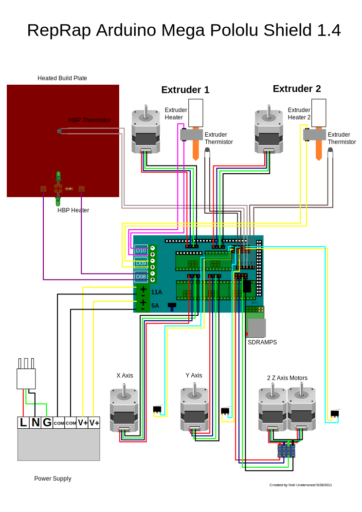
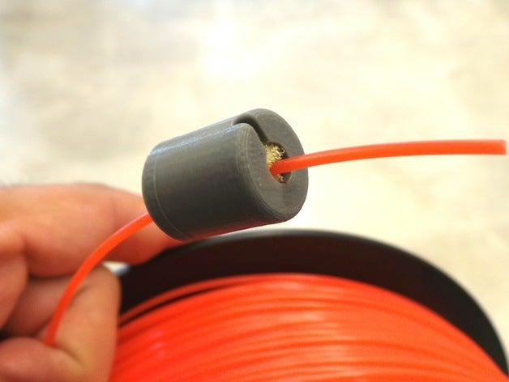
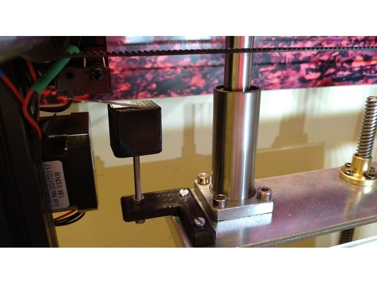

.. image:: https://readthedocs.org/projects/3d-printer-hacklab/badge/?version=latest
   :target: https://3d-printer-hacklab.readthedocs.io/en/latest/?badge=latest

.. readme-header-marker-do-not-remove

Unser 3D Drucker im Hacklab Bern
################################

Der 3D Drucker im **Hacklab Bern**, basiert auf dem `CL-260 <https://www.thingiverse.com/groups/cl-260/things>`_ open-source model und `mehr <https://www.thingiverse.com/minicooper/collections/cl-260>`_.
Er wird abwechslungsweise von Mitgliedern genutzt und verbessert.

Empfohlene PC/Mac Software
==========================

Die folgenden Software hat sich für den PC bewährt:

+-------------------------------------------------------+------------------+-------------------+
|     Software                                          | Zweck            | Chocolately Paket |
+=======================================================+==================+===================+
| Cura                                                  | Slicer           | cura-new          |
+-------------------------------------------------------+------------------+-------------------+
| `Prusa Slicer <https://www.prusa3d.com/prusaslicer>`_ | Slicer           | prusaslicer       |
+-------------------------------------------------------+------------------+-------------------+
| `Pronterface <https://www.pronterface.com/>`_         | Fernsteuerung    | printrun          |
+-------------------------------------------------------+------------------+-------------------+

Empfohlene Einstellungen
========================

Die folgenden Einstellungen haben sich für den Drucker bewährt.

+--------------------+------------------+
|     Einstellung    | Empfohlener Wert |
+====================+==================+
| Drucker Art        | FFF              |
+--------------------+------------------+
| Druckauflösung     | 0.15mm           |
+--------------------+------------------+
| PLA Temperatur     | 210°C            |
+--------------------+------------------+
| Hot bed Temperatur | 55°C             |
+--------------------+------------------+

Bestandteile
============

Der Drucker setzt sich aus den folgenden Bauteilen zusammen.

+----------------------------+-------------------------------------------------------------------------------------------------+---------------------------------------------------------------------+
|       Funktionalität       |                                        Verwendete Lösung                                        |                            Alternativen                             |
+============================+=================================================================================================+=====================================================================+
| Firmware                   | `Marlin 1.1.9 <https://github.com/MarlinFirmware/Marlin>`_                                      | `Marlin 2.0 <https://github.com/MarlinFirmware/Marlin>`_, Repetier_ |
+----------------------------+-------------------------------------------------------------------------------------------------+---------------------------------------------------------------------+
| Mikrocontroller            | `Arduino Mega 2560 <https://www.3dware.ch/Iduino-MEGA2560-De.htm>`_                             |                                                                     |
+----------------------------+-------------------------------------------------------------------------------------------------+---------------------------------------------------------------------+
| Leistungselektronik Shield | `RepRap-Arduino-Mega-Pololu-Shield (RAMPS) 1.4 <https://reprap.org/wiki/RAMPS_1.4>`_            |                                                                     |
+----------------------------+-------------------------------------------------------------------------------------------------+---------------------------------------------------------------------+
| Verstärker Schrittmotoren  | `A4988 Datasheet <https://www.allegromicro.com/~/media/Files/Datasheets/A4988-Datasheet.ashx>`_ |                                                                     |
+----------------------------+-------------------------------------------------------------------------------------------------+---------------------------------------------------------------------+
| Display Platine            | ?                                                                                               |                                                                     |
+----------------------------+-------------------------------------------------------------------------------------------------+---------------------------------------------------------------------+
| Heat Bed                   |                                                                                                 |                                                                     |
+----------------------------+-------------------------------------------------------------------------------------------------+---------------------------------------------------------------------+
| Hot End                    | Hotend: e3d v6                                                                                  |                                                                     |
+----------------------------+-------------------------------------------------------------------------------------------------+---------------------------------------------------------------------+
| Nozzle                     | 0.4mm                                                                                           |                                                                     |
+----------------------------+-------------------------------------------------------------------------------------------------+---------------------------------------------------------------------+
| Schrittmotoren             |                                                                                                 |                                                                     |
+----------------------------+-------------------------------------------------------------------------------------------------+---------------------------------------------------------------------+

.. _Repetier: https://www.repetier.com/download-software

Calibration patterns
====================

Zur Prüfung der Ausrichtung des Heizbetts eignen sich dieses speziellen Quadratmuster. Es erlaubt die Prüfung
der Druckhöhe und der Distanz zwischen Hotend und Heizbetts.

- Video: https://youtu.be/RZRY6kunAvs
- Quelle: https://www.thingiverse.com/thing:2789086
- STL: `calibration_patterns <https://github.com/chatelao/3dprinter_hacklab/tree/master/calibration_patterns>`_

.. readme-next-page-do-not-remove

Geplante Verbesserungen
#######################

Filamentreiniger
================

Auf den Filamenten haftet meist ein wenig Staub. Eine Reinigung vor dem Drucken reduziert die
Verunreinigung am Druckkopf.

Bessere Z-Axis Distanzeinhaltung
================================

Nur eine präzises Startdistanz zum Heizbett erlaubt präzise erste Schichten.

Verbesserte Stopp Schalter Führung
----------------------------------

Der End-Stops soll den Schalter wiederholbar zum gleichen Zeitpunkt auslösen. Der Würfel erlaubt
grössere Toleranzen zum Treffen des Schalters.

Quelle:

- https://www.thingiverse.com/thing:2851658
- STL: `z_axis_sensor_print <https://github.com/chatelao/3dprinter_hacklab/tree/master/z_axis_sensor_print>`_

Induktive Abstandsensoren am Druckkopf
--------------------------------------

Das sogenannte "Bed Auto Leveling" ermöglicht es ein schiefes Druckbett zu kompensieren.
Es kann den Abstand zum Druckbett laufen und an allen Stellen ausmessen.

- https://youtu.be/G-TwWfUzXpc
- Sensor: https://de.aliexpress.com/item/32568347298.html 
