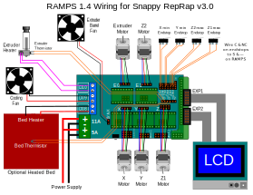

.. image:: https://readthedocs.org/projects/3d-printer-hacklab/badge/?version=latest
   :target: https://3d-printer-hacklab.readthedocs.io/en/latest/?badge=latest

.. readme-header-marker-do-not-remove

Unser 3D Drucker im Hacklab Bern
################################

Anleitung zum Drucken
~~~~~~~~~~~~~~~~~~~~~

Der 3D Drucker im **Hacklab Bern**, basiert auf dem `CL-260 <https://www.thingiverse.com/groups/cl-260/things>`_ open-source `Model <https://www.thingiverse.com/minicooper/collections/cl-260>`_.
Er wird abwechslungsweise von Mitgliedern genutzt und verbessert.

Empfohlene PC/Mac Software
==========================

Die folgenden Software hat sich für den PC bewährt:

+-------------------------------------------------------+---------------+-------------------+
|                       Software                        |     Zweck     | Chocolately Paket |
+=======================================================+===============+===================+
| Cura                                                  | Slicer        | cura-new          |
+-------------------------------------------------------+---------------+-------------------+
| `Prusa Slicer <https://www.prusa3d.com/prusaslicer>`_ | Slicer        | prusaslicer       |
+-------------------------------------------------------+---------------+-------------------+
| `Pronterface <https://www.pronterface.com/>`_         | Fernsteuerung | printrun          |
+-------------------------------------------------------+---------------+-------------------+

Empfohlene Einstellungen
========================

Die folgenden Einstellungen haben sich für den Drucker bewährt.

+--------------------+----------------------------------+
|    Einstellung     |         Empfohlener Wert         |
+====================+==================================+
| Drucker Art        | FFF (Fused Filament Fabrication) |
+--------------------+----------------------------------+
| Druckauflösung     | 0.15mm                           |
+--------------------+----------------------------------+
| PLA Temperatur     | 210°C                            |
+--------------------+----------------------------------+
| Hot bed Temperatur | 55°C                             |
+--------------------+----------------------------------+

Fehlersuche
===========

Die Fehlersuche am Drucker ist mühsam, allerdings bietet Pursa ein Handbuch
zum Erkennen der gängigsten Fehler:

- https://www.prusa3d.com/print-quality-troubleshooting/

Dazu hat auch der 3D-Andi ein hervorragendes Video mit vielen Fehlerquellen und -lösungen gedreht:

- https://www.youtube.com/watch?v=WL3T_ijUUs8

Düse montieren
==============

- https://youtu.be/OzRAVkXjw3I

Calibration patterns
====================

Zur Prüfung der Ausrichtung des Heizbetts eignen sich dieses speziellen Quadratmuster. Es erlaubt die Prüfung
der Druckhöhe und der Distanz zwischen Hotend und Heizbetts.

- Video: https://youtu.be/RZRY6kunAvs
- Quelle: https://www.thingiverse.com/thing:2789086
- STL: `calibration_patterns <https://github.com/chatelao/3dprinter_hacklab/tree/master/calibration_patterns>`_

.. image:: 30_calibration_patterns/a11e319e6441382d85e158443514f1c2_preview_featured.jpg
   :width: 500 px

Support Forum
=============

https://www.3d-druck-community.de/

Aktueller Aufbau
~~~~~~~~~~~~~~~~

Aktuell Marlin Konfiguration
============================

Mit der Pronterface_ Software kann der Drucker über `gCode Befehle <http://marlinfw.org/docs/gcode/M115.htmlüber>`_ oder das GUI mit der seriellen Schnittstelle ferngesteuert und untersucht werden:

.. image:: 55_pronterface/pronterface_gui.jpg
   :width: 300 px

1a. M115 - Firmware Informations

::
  
    FIRMWARE_NAME:Marlin V1
    Sprinter/grbl mashup for gen6 
    FIRMWARE_URL:https://github.com/ErikZalm/Marlin/
    PROTOCOL_VERSION:1.0
    MACHINE_TYPE:Mendel
    EXTRUDER_COUNT:1
    UUID:00000000-0000-0000-0000-000000000000

1b. M115 - Firmware Informations

::

   >>> M115
   SENDING:M115
   FIRMWARE_NAME:Marlin 2.0.x (GitHub)
   SOURCE_CODE_URL:https://github.com/MarlinFirmware/Marlin
   PROTOCOL_VERSION:1.0
   MACHINE_TYPE:Hacklab CL-260 
   EXTRUDER_COUNT:1 
   UUID:b01ac89d-d7b3-43ec-8f82-dfb65c785486
   
   Cap:SERIAL_XON_XOFF:0
   Cap:BINARY_FILE_TRANSFER:0
   Cap:EEPROM:0
   Cap:VOLUMETRIC:1
   Cap:AUTOREPORT_TEMP:1
   Cap:PROGRESS:0
   Cap:PRINT_JOB:1
   Cap:AUTOLEVEL:0
   Cap:Z_PROBE:0
   Cap:LEVELING_DATA:0
   Cap:BUILD_PERCENT:0
   Cap:SOFTWARE_POWER:0
   Cap:TOGGLE_LIGHTS:0
   Cap:CASE_LIGHT_BRIGHTNESS:0
   Cap:EMERGENCY_PARSER:0
   Cap:PROMPT_SUPPORT:0
   Cap:AUTOREPORT_SD_STATUS:0

2a. M503 - Report Settings (Marlin V1)

::

   SENDING:M503
   echo:Steps per unit:
   echo:  M92 X80.00 Y80.00 Z1600.00 E145.00
   echo:Maximum feedrates (mm/s):
   echo:  M203 X300.00 Y300.00 Z5.00 E45.00
   echo:Maximum Acceleration (mm/s2):
   echo:  M201 X9000 Y9000 Z100 E10000
   echo:Acceleration: S=acceleration, T=retract acceleration
   echo:  M204 S3000.00 T3000.00
   echo:Advanced variables: S=Min feedrate (mm/s), T=Min travel feedrate (mm/s), B=minimum segment time (ms), X=maximum XY jerk (mm/s),  Z=maximum Z jerk (mm/s),  E=maximum E jerk (mm/s)
   echo:  M205 S0.00 T0.00 B20000 X20.00 Z0.40 E5.00
   echo:Home offset (mm):
   echo:  M206 X0.00 Y0.00 Z0.00
   echo:PID settings:
   echo:   M301 P22.20 I1.08 D114.00

2b. M503 - Report Settings (Marlin 2.0.x)
::

   SENDING:M503
   echo:  G21    ; Units in mm (mm)
   echo:Filament settings: Disabled
   echo:  M200 D1.75
   echo:  M200 D0
   echo:Steps per unit:
   echo: M92 X80.00 Y80.00 Z1600.00 E145.00
   echo:Maximum feedrates (units/s):
   echo:  M203 X300.00 Y300.00 Z5.00 E45.00
   echo:Maximum Acceleration (units/s2):
   echo:  M201 X9000.00 Y9000.00 Z100.00 E10000.00
   echo:Acceleration (units/s2): P<print_accel> R<retract_accel> T<travel_accel>
   echo:  M204 P3000.00 R3000.00 T3000.00
   echo:Advanced: B<min_segment_time_us> S<min_feedrate> T<min_travel_feedrate> J<junc_dev>
   echo:  M205 B20000.00 S0.00 T0.00 J0.01
   echo:Home offset:
   echo:  M206 X0.00 Y0.00 Z0.00
   echo:Material heatup parameters:
   echo:  M145 S0 H180 B70 F0
   echo:  M145 S1 H240 B110 F0
   echo:PID settings:
   echo:  M301 P22.20 I1.08 D114.00

+--------------------------------+-------+-----------+--------------+
|          Einstellung           | gCode | Marlin V1 | Marlin 2.0.x |
+================================+=======+===========+==============+
| Units in mm (mm)               | G21   | n/a       |              |
+--------------------------------+-------+-----------+--------------+
| Filament diameter              | M200  | n/a       | D1.75        |
+--------------------------------+-------+-----------+--------------+
| Steps per unit                 | M92   | X80.00    | X80.00       |
|                                |       +-----------+--------------+
|                                |       | Y80.00    | Y80.00       |
|                                |       +-----------+--------------+
|                                |       | Z1600.00  | Z1600.00     |
|                                |       +-----------+--------------+
|                                |       | E145.00   | E145.00      |
+--------------------------------+-------+-----------+--------------+
| Max. feedrates (mm/s)          | M203  | X300.00   | X300.00      |
|                                |       +-----------+--------------+
|                                |       | Y300.00   | Y300.00      |
|                                |       +-----------+--------------+
|                                |       | Z5.00     | Z5.00        |
|                                |       +-----------+--------------+
|                                |       | E45.00    | E45.00       |
+--------------------------------+-------+-----------+--------------+
| Max. Acceleration (mm/s2)      | M201  |           | X9000        |
|                                |       +-----------+--------------+
|                                |       |           | Y9000        |
|                                |       +-----------+--------------+
|                                |       |           | Z100         |
|                                |       +-----------+--------------+
|                                |       |           | E10000       |
+--------------------------------+-------+-----------+--------------+
| S=Acceleration                 | M204  | S3000.00  |              |
+--------------------------------+       +-----------+--------------+
| P=Print Acceleration (mm/s2)   |       |           | P3000.00     |
+--------------------------------+       +-----------+--------------+
| R=Retract Acceleration (mm/s2) |       |           | R3000.00     |
+--------------------------------+       +-----------+--------------+
| T=Retract Acceleration (mm/s2) |       | T3000.00  |              |
+--------------------------------+       +-----------+--------------+
| T=Travel Acceleration (mm/s2)  |       |           | T3000.00     |
+--------------------------------+-------+-----------+--------------+
| B=minimum segment time (ms)    | M205  | B20000    | B20000       |
+--------------------------------+       +-----------+--------------+
| S=Min feedrate (mm/s)          |       | S0.00     | S0.00        |
+--------------------------------+       +-----------+--------------+
| T=Min travel feedrate (mm/s)   |       | T0.00     | T0.00        |
+--------------------------------+       +-----------+--------------+
| X=maximum XY jerk (mm/s)       |       | X20.00    |              |
+--------------------------------+       +-----------+--------------+
| Z=maximum Z jerk (mm/s)        |       | Z0.40     |              |
+--------------------------------+       +-----------+--------------+
| E=maximum E jerk (mm/s)        |       | E5.0      |              |
+--------------------------------+       +-----------+--------------+
| J=Junc_dev                     |       |           | J0.01        |
+--------------------------------+-------+-----------+--------------+
| Home offset (mm)               | M206  |           | X0.00        |
|                                |       |           | Y0.00        |
|                                |       |           | Z0.00        |
+--------------------------------+-------+-----------+--------------+
| PID settings                   | M301  | P22.20    | P22.20       |
|                                |       +-----------+--------------+
|                                |       | I1.08     | I1.08        |
|                                |       +-----------+--------------+
|                                |       | D114.00   | D114.00      |
+--------------------------------+-------+-----------+--------------+

Bestandteile
============

Der Drucker setzt sich aus den folgenden Bauteilen zusammen.

+---------------------------------------------------------+-------------------------------------------------------------------------------------------------+
|                     Funktionalität                      |                                        Verwendete Lösung                                        |
+=========================================================+=================================================================================================+
| Firmware                                                | `Marlin 1.1.9 <https://github.com/MarlinFirmware/Marlin>`_                                      |
+---------------------------------------------------------+-------------------------------------------------------------------------------------------------+
| Mikrocontroller                                         | `Arduino Mega 2560 <https://www.3dware.ch/Iduino-MEGA2560-De.htm>`_                             |
+---------------------------------------------------------+-------------------------------------------------------------------------------------------------+
| Leistungselektronik Shield                              | `RepRap-Arduino-Mega-Pololu-Shield (RAMPS) 1.4 <https://reprap.org/wiki/RAMPS_1.4>`_            |
+---------------------------------------------------------+-------------------------------------------------------------------------------------------------+
| Verstärker Schrittmotoren                               | `A4988 Datasheet <https://www.allegromicro.com/~/media/Files/Datasheets/A4988-Datasheet.ashx>`_ |
+---------------------------------------------------------+-------------------------------------------------------------------------------------------------+
| Display Platine                                         | vermutlich: RepRapdiscount smart controller 2004 LCD (RED)                                      |
+---------------------------------------------------------+-------------------------------------------------------------------------------------------------+
| Heat Bed                                                |                                                                                                 |
+---------------------------------------------------------+-------------------------------------------------------------------------------------------------+
| Hot End                                                 | Hotend: e3d v6                                                                                  |
+---------------------------------------------------------+-------------------------------------------------------------------------------------------------+
| Nozzle                                                  | 0.4mm                                                                                           |
+---------------------------------------------------------+-------------------------------------------------------------------------------------------------+
| `3D Teile <https://www.thingiverse.com/thing:1800495>`_ | Gedruckte Teile                                                                                 |
+---------------------------------------------------------+-------------------------------------------------------------------------------------------------+
| Schrittmotoren                                          | NEMA ?                                                                                          |
+---------------------------------------------------------+-------------------------------------------------------------------------------------------------+
| Stromversorgung                                         | Schaltnetzteil 12V 20A ohne aktive Kühlung                                                      |
+---------------------------------------------------------+-------------------------------------------------------------------------------------------------+
| Medium                                                  | SD-Karten regulärer Grösse                                                                      |
+---------------------------------------------------------+-------------------------------------------------------------------------------------------------+
| Datenkabel                                              | USB-Kabel mit Standard-B Stecker den Mikrocontroller                                            |
+---------------------------------------------------------+-------------------------------------------------------------------------------------------------+

.. _Repetier: https://www.repetier.com/download-software

.. readme-next-page-do-not-remove

Geplante Verbesserungen
#######################

Erweiterungen
~~~~~~~~~~~~~

Filamentreiniger
================

Auf den Filamenten haftet meist ein wenig Staub. Eine Reinigung vor dem Drucken reduziert die
Verunreinigung am Druckkopf.

.. image:: 20_filament_cleaner/Universal_Filament_Filter_v020_preview_featured.jpg
   :width: 300 px

Ersatz bestehender Teile
~~~~~~~~~~~~~~~~~~~~~~~~

Bessere Z-Axis Distanzeinhaltung
================================

Nur eine präzises Startdistanz zum Heizbett erlaubt präzise erste Schichten.

Verbesserte Stopp Schalter Führung
----------------------------------

Der End-Stops soll den Schalter wiederholbar zum gleichen Zeitpunkt auslösen. Der Würfel erlaubt
grössere Toleranzen zum Treffen des Schalters.

Quelle:

- https://www.thingiverse.com/thing:2851658
- STL: `z_axis_sensor_print <https://github.com/chatelao/3dprinter_hacklab/tree/master/z_axis_sensor_print>`_

.. image:: 03_z_axis_sensor_print/5cc3017be026a4b2a4c0659578d3ea0d_preview_featured.jpg
   :width: 500 px

Induktive Abstandsensoren am Druckkopf
--------------------------------------

Das sogenannte "Bed Auto Leveling" ermöglicht es ein schiefes Druckbett zu kompensieren.
Es kann den Abstand zum Druckbett laufen und an allen Stellen ausmessen.

- https://youtu.be/G-TwWfUzXpc
- Sensor: https://de.aliexpress.com/item/32568347298.html

Verbesserte Halterung
- https://www.thingiverse.com/thing:2332037

Bessere LCD-Anzeige
===================

Die LCD-Anzeige dient zur Steuerung des Druckers direkt am Gerät. Der SD-Card Leser
ist ebenfalls direkt in das Modul eingebaut. Dazu muss die 
`Marlin Konfiguration <http://marlinfw.org/docs/configuration/configuration.html#lcd-controller>`_
korrekt eingestellt werden.

Aktuell enthält der Drucker ein einfaches, sehr funktionales LCD 20x2 Zeichen Display.
Ein grösseres Display könnte die gleichen Daten etwas komfortabler darstellen. Eine
Option ist ein $8
`LCD 12864 Module from Aliexpress <https://www.aliexpress.com/item/1000007365397.html>`_.

.. image:: 15_lcd_12864/d715ff343a1bbe875cc5d8fa0ba307a8_preview_featured.jpg
   :width: 500 px

Ein dazu passendes Gehäuse fand sich auf `Thingiverse <https://www.thingiverse.com/thing:2813298>`_,
oder hier im `Verzeichnis <https://github.com/chatelao/3dprinter_hacklab/blob/master/lcd_12864/Top_Shell.stl>`_.

Durchgeführte Verbesserungen
~~~~~~~~~~~~~~~~~~~~~~~~~~~~

Neue Firmware
=============

Die aktuelle Firmware funktioniert wie gewünscht, ist allerdings nicht auf dem allerneusten Stand.
Allfällige Verbesserungen in der Logik und Sicherheit der letzten Jahre fehlen noch und der
Sourcecode ist aktuell nicht bekannt, allerdings ergibt die "M115" Abfrage ein Marlin V1.

Daher wären eine Aktualisierung in Erwägungen zu ziehen:

#. Die bestehende Firmware durch Ausbau des Arduino Mega Boards sichern.
#. Ein neues Arduino Mega Board (`$9 Aliexpress <https://www.aliexpress.com/item/32719027443.html>`_) für die Versuche mit der neuen Firmware einbauen.
#. Neue Firmware  `Marlin 2.0 <https://github.com/MarlinFirmware/Marlin>`_ oder Repetier_ herunterladen.
#. Die Software für den Drucker konfigurieren (siehe HW-Konfiguration).
#. Die Software installieren und mit Pronterface_ testen.

Hilfestellungen in der Fehlersuche der neuen Konfiguration:

- https://www.youtube.com/watch?v=0pt_b2ZizQM
- https://www.youtube.com/watch?v=lAKyZd63_ns (2016: https://www.youtube.com/watch?v=3gwWVFtdg-4)

Abfrage der Endabschalter
--------------------------

Mit der gCode Befehl M119 kann der aktuelle Zustand der Endabschalter ausgelesen werden.
Die Abfrage zeigt bei unserer Elektronik ausgelöste Stopps im offenen Zustand:

::

   Reporting endstop status
   x_min: TRIGGERED
   y_min: TRIGGERED
   z_min: TRIGGERED

Ein anschliessend testweise ausgelöster Z-Entstopp wird als offen angezeigt, der Wert wird
also fehlerfrei ausgelesen und ist nur invertiert:

::

   Reporting endstop status
   x_min: TRIGGERED
   y_min: TRIGGERED
   z_min: open

Zur Korrektur muss die Konfiguration angepasst werden. Die xxx_MIN_ENDSTOP_INVERTING Werte sind
normalerweise "false" und müssen auf "true" umgestellt werden:

::

   #define X_MIN_ENDSTOP_INVERTING true
   #define Y_MIN_ENDSTOP_INVERTING true
   #define Z_MIN_ENDSTOP_INVERTING true
